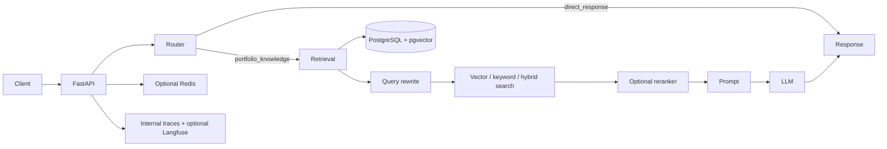

# Production Chatbot

[](https://github.com/TumeloKonaite/Production_chat/actions/workflows/ci.yml)
[](https://www.python.org/)
[](https://fastapi.tiangolo.com/)
[](https://docs.astral.sh/uv/)
[](https://docs.docker.com/compose/)

Production Chatbot is the FastAPI backend for Tumelo Konaite's portfolio assistant. It answers questions grounded in an approved portfolio knowledge base and returns deterministic guidance for greetings, unclear follow-ups, and questions outside that scope.

The assistant is deliberately not a general-purpose chatbot. Questions about technologies are answered only when they relate to Tumelo's experience or projects.

## What the project does

- Routes portfolio questions to retrieval-augmented generation (RAG).
- Handles greetings, acknowledgements, clarification, and out-of-scope messages without an LLM call.
- Retrieves from PostgreSQL/pgvector with vector, keyword, or hybrid search.
- Supports project-aware retrieval, query rewriting, and optional LLM reranking.
- Ingests curated Markdown plus uploaded Markdown or plain-text files.
- Provides retrieval, fixed-context generation, and end-to-end RAG evaluations.
- Records internal traces and optionally exports operational traces to Langfuse.
- Logs experiments locally with MLflow or remotely through DagsHub.
- Supports caching and fixed-window rate limiting through Upstash Redis.
- Deploys the API and ingestion worker to Modal.

## Architecture at a glance



[Read the architecture guide](docs/architecture.md).

## Technology stack

| Area | Implementation |
|---|---|
| API | Python 3.12, FastAPI, Uvicorn |
| Persistence | SQLAlchemy, Alembic, PostgreSQL |
| Retrieval | pgvector, vector/keyword/hybrid strategies |
| Models | OpenAI or OpenRouter; Hugging Face, OpenAI, or OpenRouter embeddings |
| Object storage | MinIO locally; local filesystem or Supabase Storage alternatives |
| Cache and rate limiting | Optional Upstash Redis REST; Redis Stack for the legacy response-cache path |
| Observability | Internal trace tables and optional Langfuse |
| Experiment tracking | MLflow, optionally initialized through DagsHub |
| Deployment | Modal and GitHub Actions |

## Prerequisites

- Git
- Python 3.12
- [uv](https://docs.astral.sh/uv/)
- Docker with Docker Compose
- An OpenAI or OpenRouter API key for generated chat responses and generation evaluations

PostgreSQL, pgvector, Redis, MinIO, and pgAdmin do not need host installations when Docker Compose is used.

## Quick start

The shortest reliable setup runs the Python application on the host and its dependencies in Docker.

1. Clone and enter the repository.

   ```bash
   git clone https://github.com/TumeloKonaite/Production_chat.git
   cd Production_chat
   ```

2. Install the locked dependencies. `uv sync` creates `.venv` automatically.

   ```bash
   uv sync --locked
   ```

3. Create local configuration.

   Linux/macOS:

   ```bash
   cp .env.example .env
   ```

   Windows PowerShell:

   ```powershell
   Copy-Item .env.example .env
   ```

   Set one model-provider key in `.env`:

   ```env
   LLM_PROVIDER=openai
   LLM_MODEL=gpt-4.1-mini
   LLM_API_KEY=your-openai-api-key
   ```

   To use OpenRouter, set `LLM_PROVIDER=openrouter`, choose an OpenRouter model, set `LLM_BASE_URL=https://openrouter.ai/api/v1`, and provide its key.

4. Start the local dependencies.

   ```bash
   docker compose up -d db redis minio
   ```

   PostgreSQL is exposed on `127.0.0.1:5434`, Redis on `6379`, and MinIO on `9000` (`9001` for its console). Redis is available for optional features but disabled by default.

5. Apply database migrations.

   ```bash
   uv run alembic upgrade head
   ```

6. Ingest the curated knowledge in `app/knowledge/source/`.

   ```bash
   uv run python scripts/ingest_knowledge.py
   ```

   The default Hugging Face embedding model is downloaded on first use.

7. Start the API with reload enabled.

   ```bash
   uv run uvicorn main:app --reload
   ```

8. Verify the service in another terminal.

   ```bash
   curl http://127.0.0.1:8000/health
   curl http://127.0.0.1:8000/ready
   ```

   Expected health response:

   ```json
   {"status":"ok"}
   ```

9. Send a portfolio question.

   Linux/macOS:

   ```bash
   curl -X POST http://127.0.0.1:8000/chat \
     -H "Content-Type: application/json" \
     -d '{"message":"What projects has Tumelo built?"}'
   ```

   Windows PowerShell:

   ```powershell
   Invoke-RestMethod -Method Post -Uri http://127.0.0.1:8000/chat `
     -ContentType 'application/json' `
     -Body '{"message":"What projects has Tumelo built?"}'
   ```

OpenAPI is available at <http://127.0.0.1:8000/docs>. See [local development](docs/local-development.md) for virtual-environment activation, full Compose operation, reset instructions, and frontend integration.

## Configuration

`.env.example` is the canonical list of variable names and development-safe defaults. Basic local startup uses its default database, embedding, retrieval, and storage settings; a model API key is needed only when a request reaches generation.

Never commit `.env` or production credentials. See the [complete configuration reference](docs/configuration.md) for required/optional settings, provider alternatives, aliases, and production requirements.

## Running with Docker

The recommended mode starts dependency services only:

```bash
docker compose up -d db redis minio
```

The `api` Compose service is also defined, but container-facing configuration must use service hostnames, including:

```env
DATABASE_URL=postgresql+psycopg://postgres:postgres@db:5432/production_chatbot
MINIO_ENDPOINT=http://minio:9000
REDIS_URL=redis://redis:6379/0
```

Then run:

```bash
docker compose up -d --build
docker compose exec api uv run alembic upgrade head
docker compose exec api uv run python scripts/ingest_knowledge.py
```

The API container does not run migrations or ingestion automatically. Read the [local development guide](docs/local-development.md) before using this mode.

## Knowledge ingestion

The built-in portfolio source is ingested with:

```bash
uv run python scripts/ingest_knowledge.py
```

Re-ingestion replaces chunks for each source rather than duplicating them. Uploaded `.md` and `.txt` files use the upload and asynchronous ingestion APIs. Read the [knowledge ingestion guide](docs/ingestion.md).

## Testing and quality checks

Run the same checks as CI:

```bash
uv run ruff check .
uv run python -m pytest
```

Database integration tests are opt-in through `RUN_DB_INTEGRATION_TESTS=true` and `TEST_DATABASE_URL`. Unit tests do not require live provider credentials.

## Evaluations

After migrations and knowledge ingestion, run a retrieval baseline:

```bash
uv run python -m evals.runners.run_retrieval_eval --config evals/configs/retrieval_baseline.json
```

Run fixed-context generation evaluation with configured answer and judge models:

```bash
uv run python -m evals.runners.run_generation_eval
```

Results are written under `evals/results/`; MLflow logging is disabled unless explicitly enabled. Read the [evaluation guide](docs/evaluation.md) for schemas, metrics, matrix suites, tracking, and cost-bearing commands.

## Observability

Every generated chat path can persist an internal trace and step records in PostgreSQL. Langfuse is optional and disabled by default. MLflow/DagsHub are experiment tracking systems, not request observability.

Read the [observability and experiment tracking guide](docs/observability.md).

## Deployment

The supported backend production target is Modal: one ASGI function serves FastAPI and a second function executes queued ingestion jobs. GitHub Actions validates pushes and pull requests; successful pushes to `main` deploy and smoke-test Modal. The separate frontend is expected to run on Vercel or another configured origin.

Read the [deployment guide](docs/deployment.md).

## Documentation

| Guide | Purpose |
|---|---|
| [Documentation index](docs/README.md) | Find the authoritative guide for each workflow |
| [Architecture](docs/architecture.md) | Understand routes, retrieval, storage, and topology |
| [Configuration](docs/configuration.md) | Configure all implemented subsystems |
| [Local development](docs/local-development.md) | Install, run, verify, stop, and reset locally |
| [Ingestion](docs/ingestion.md) | Load and replace approved portfolio knowledge |
| [Evaluation](docs/evaluation.md) | Run and compare retrieval, generation, and RAG evaluations |
| [Observability](docs/observability.md) | Configure traces, logs, MLflow, and DagsHub |
| [Deployment](docs/deployment.md) | Deploy and operate the Modal backend |
| [Troubleshooting](docs/troubleshooting.md) | Diagnose common setup and runtime failures |
| [Contributing](docs/contributing.md) | Follow repository quality and documentation expectations |

## Contributing

Run linting and tests before opening a pull request. Changes to configuration, commands, API behavior, routing, ingestion, evaluation, integrations, or deployment must update their authoritative documentation and `.env.example` where applicable.

Read the [contribution guide](docs/contributing.md).

## License

No license file is currently included. Treat the source as all rights reserved unless the repository owner adds a license.
