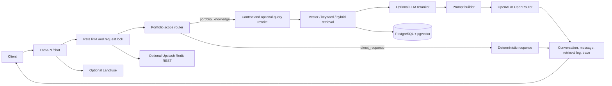
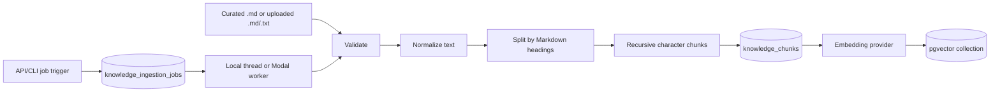
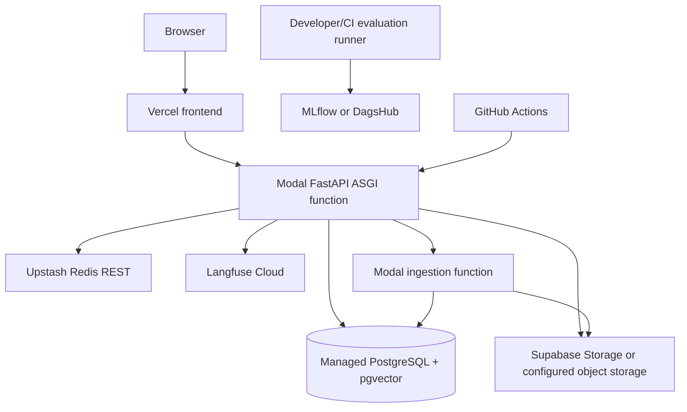

# Architecture

## Purpose and scope

Production Chatbot is a portfolio-scoped assistant for Tumelo Konaite. Approved questions cover profile, projects, skills, experience, education, certifications, and contact information. The application is not a general-purpose assistant.

Technical questions are in scope only when they ask how Tumelo used a technology or when conversational context clearly refers to his work. An unrelated technical question is redirected toward a relevant portfolio question.

## Request routes

The router in `app/services/chat/models.py` exposes exactly two top-level routes:

```python
class QueryRoute(StrEnum):
    PORTFOLIO_KNOWLEDGE = "portfolio_knowledge"
    DIRECT_RESPONSE = "direct_response"
```

`PORTFOLIO_KNOWLEDGE` retrieves approved knowledge and generates a grounded answer. `DIRECT_RESPONSE` uses deterministic templates for greetings, acknowledgements, unresolved follow-ups, and out-of-scope requests; it does not require retrieval or generation.

Portfolio retrieval has two routing modes:

```python
class RetrievalMode(StrEnum):
    HYBRID = "hybrid"
    PROJECT_OVERVIEW = "project_overview"
```

- `HYBRID` is the normal focused-question mode. Its name is a routing concept; the actual search strategy still follows `RETRIEVER_TYPE` (`vector`, `keyword`, or `hybrid`).
- `PROJECT_OVERVIEW` is selected for broad project questions and retrieves project-oriented context.

Conversation context can resolve short follow-ups. If a follow-up cannot be resolved, the direct route asks for clarification.

## Request lifecycle



For a portfolio request, the service:

1. Validates the message and conversation identifier.
2. Applies the optional operational rate limit and duplicate-request lock.
3. Resolves recent conversation context and chooses a route.
4. Checks the optional exact response cache.
5. Optionally rewrites the retrieval query.
6. Retrieves candidates using the configured strategy.
7. Optionally reranks a larger candidate set with an LLM.
8. Builds the selected prompt with the retrieved chunks.
9. Calls the selected model configuration.
10. Persists messages, retrieval details, token/cost metadata, and trace steps.
11. Optionally writes cache state and sends a parallel trace to Langfuse.

## Retrieval

`RetrievalService` owns the embedding provider and search strategy:

- Vector search uses pgvector-backed embeddings.
- Keyword search ranks database content without vector similarity.
- Hybrid search combines normalized vector and keyword scores.
- Query rewriting is opt-in and falls back to the original query on failure.
- LLM reranking is opt-in; `RERANKER_INITIAL_TOP_K` must not be smaller than `RERANKER_FINAL_TOP_K`.

The current vector-store implementations are PostgreSQL/pgvector and Supabase pgvector. Supabase pgvector still uses PostgreSQL as the system of record while selecting a Supabase-aware vector implementation.

## Ingestion lifecycle



The direct CLI ingests `app/knowledge/source/**/*.md` synchronously. The trigger API/CLI creates an idempotent job based on source checksum plus embedding and chunk settings. Local jobs run in a daemon thread; production jobs can spawn the named Modal function.

For each source, ingestion deletes the existing chunk rows and inserts the current chunks. It then replaces vector entries for the indexed chunks. This prevents duplicate chunks but means a changed embedding dimension must be paired with the correct database/vector schema and a complete re-ingestion.

## Database responsibilities

PostgreSQL stores:

- conversations and messages;
- message feedback;
- curated and uploaded knowledge chunk metadata/content;
- vector collections and embeddings through pgvector/LangChain PostgreSQL integration;
- retrieval logs;
- evaluation runs/results when persistence is requested;
- uploaded-file metadata and ingestion jobs;
- internal chat traces and trace steps.

Alembic is the schema authority. `DATABASE_DIRECT_URL`, when configured, is used for migrations and direct administrative work; runtime traffic uses `DATABASE_URL`.

Uploaded file bytes live outside PostgreSQL in MinIO, local filesystem storage, or Supabase Storage.

## Caching and rate limiting

The primary operational path uses Upstash Redis's REST API when `ENABLE_REDIS=true`:

- an exact-response cache controlled by `EXACT_CACHE_*`;
- duplicate-request locks controlled by `REQUEST_LOCK_*`;
- a fixed-window request limit controlled by `RATE_LIMIT_*`.

If Upstash calls fail, the implemented rate limiter logs and fails open. The separate `ENABLE_RESPONSE_CACHE`/`REDIS_URL` settings configure a legacy response-cache service, including an optional semantic cache; do not confuse this path with the primary Upstash cache client.

## Observability and experiment tracking

Internal traces are persisted alongside application data and can link to an external provider trace ID. Optional Langfuse traces capture a root chat observation plus retrieval and model observations, including source IDs, previews, latency, token usage, and estimated cost.

MLflow and DagsHub are used by evaluation runners, not as live request telemetry. DagsHub initialization still uses MLflow as the logging API.

## Evaluation architecture

Three evaluation layers intentionally use different datasets:

- Retrieval evaluation queries the configured knowledge index and reports ranking metrics.
- Fixed-context generation evaluation holds context constant and measures model/prompt answer quality.
- RAG evaluation executes retrieval plus generation and judge scoring end to end.

Matrix suites expand controlled combinations of embeddings, retrieval strategies, top-k, model, and prompt. Artifacts are always written locally; MLflow/DagsHub logging is optional.

## Deployment topology



The repository deploys only the backend and ingestion worker. Frontend deployment is external to this repository; its origin is supplied through `FRONTEND_ORIGIN`.

See [chat routing details](architecture/chat-routing.md), [configuration](configuration.md), and [deployment](deployment.md).
